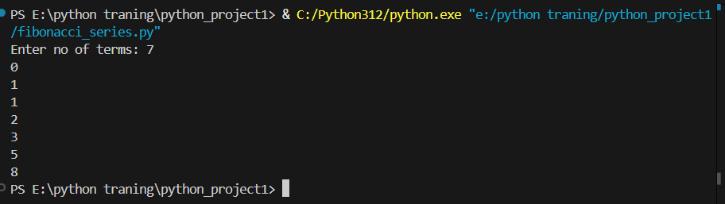

# my first python project
# Fibonaci number
# Iteration method

**Logic**
*logic*
```
  while n-2>0:
    n3=n1+n2
    n1=n2
    n2=n3
    print(n3)
    n=n-1
    
    
```


[Github Link](https://github.com/harishkannann05/python_project1.git) 